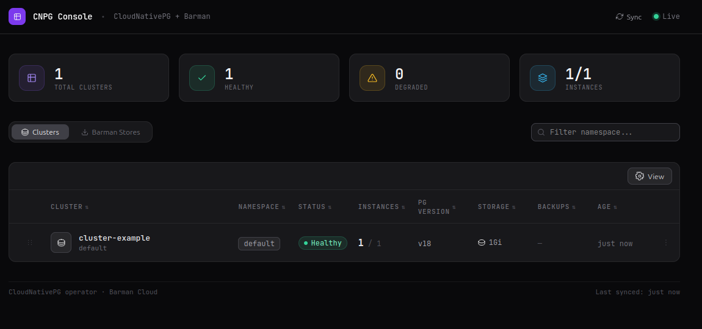

# CNPG Dashboard

A web dashboard for CloudNativePG clusters and Barman object stores. Watches CNPG CRDs via Kubernetes informers and provides a real-time UI with WebSocket updates.



## Prerequisites

- Go 1.26+
- Node.js (for frontend build)
- Kubernetes cluster with [CloudNativePG operator](https://cloudnative-pg.io/) installed

## Quick Start

```bash
# Build and run locally (requires kubeconfig)
make frontend   # build React app to static/
make run        # serve on :8080

# Or with Docker
make build      # go build only
docker build -t cnpg-dashboard .
docker run -v ~/.kube:/root/.kube:ro -p 8080:8080 cnpg-dashboard
```

## Local Dev (Tilt + kind)

```bash
make kind-create   # create kind cluster
make tilt-up      # build, load image, deploy via Helm
```

## Helm

```bash
helm install cnpg-dashboard charts/cnpg-dashboard
```

The dashboard needs RBAC to watch Cluster and BarmanObjectStore CRDs. The chart creates a ServiceAccount with the required permissions.
